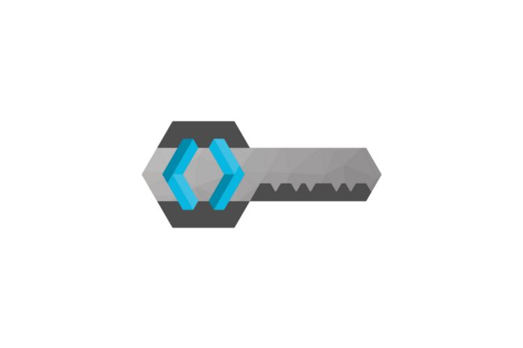

<h1>Hi, I'm Diego!</h1>

I'm a passionate Software Developer with a strong focus on Java, Spring Boot, and React. I specialize in crafting robust RESTful APIs and designing creative, user-friendly frontends.

Contact with me:

[.png)](www.linkedin.com/in/diego-parula)

I have worked with technologies such as:

